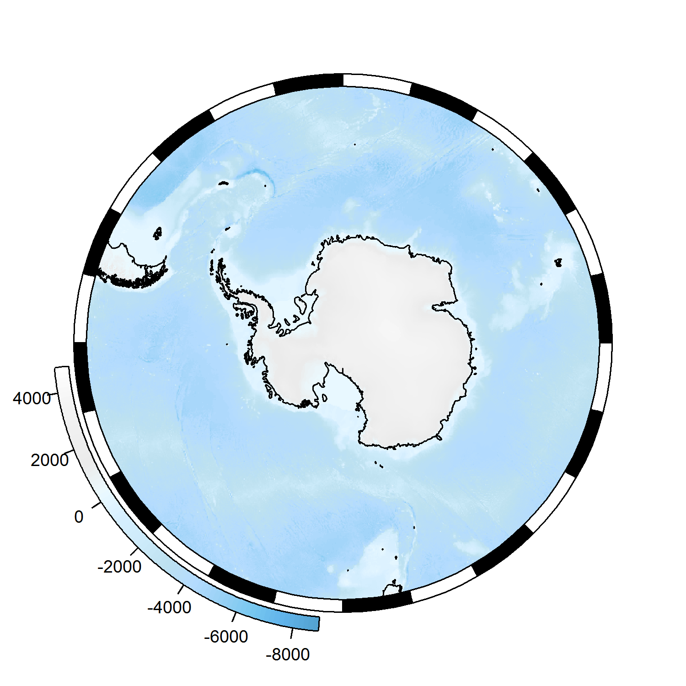
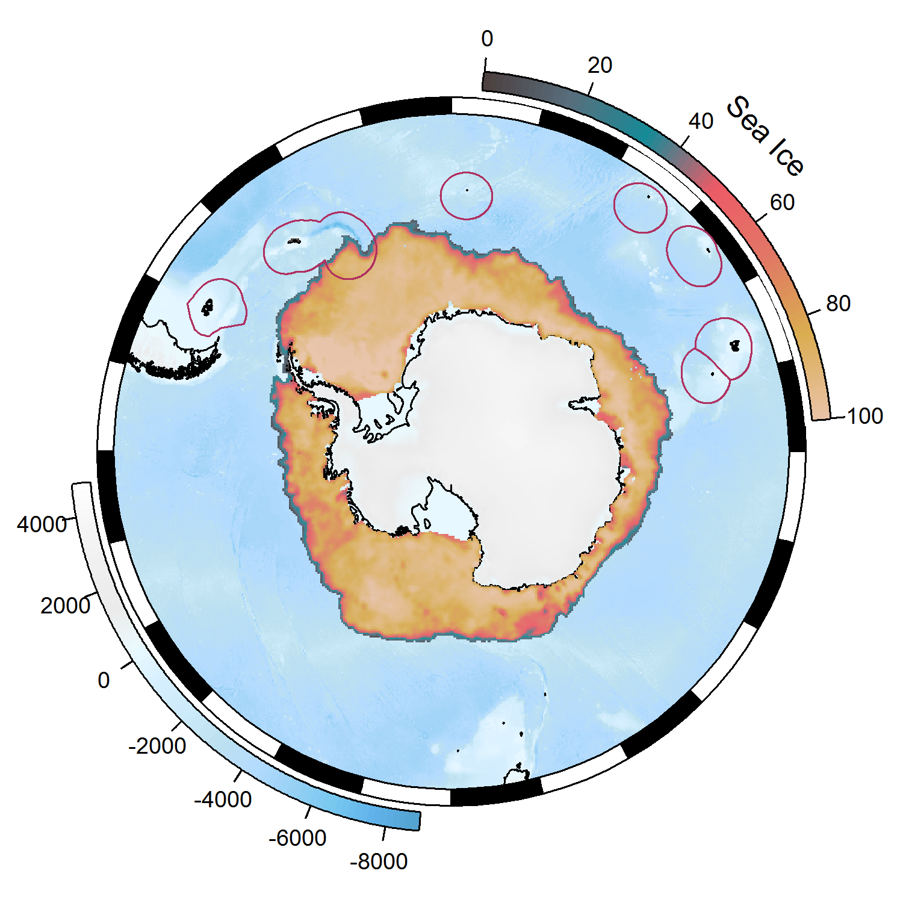
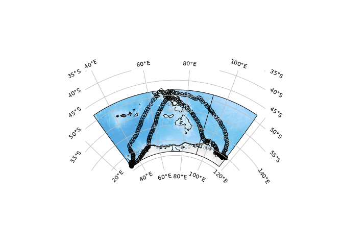
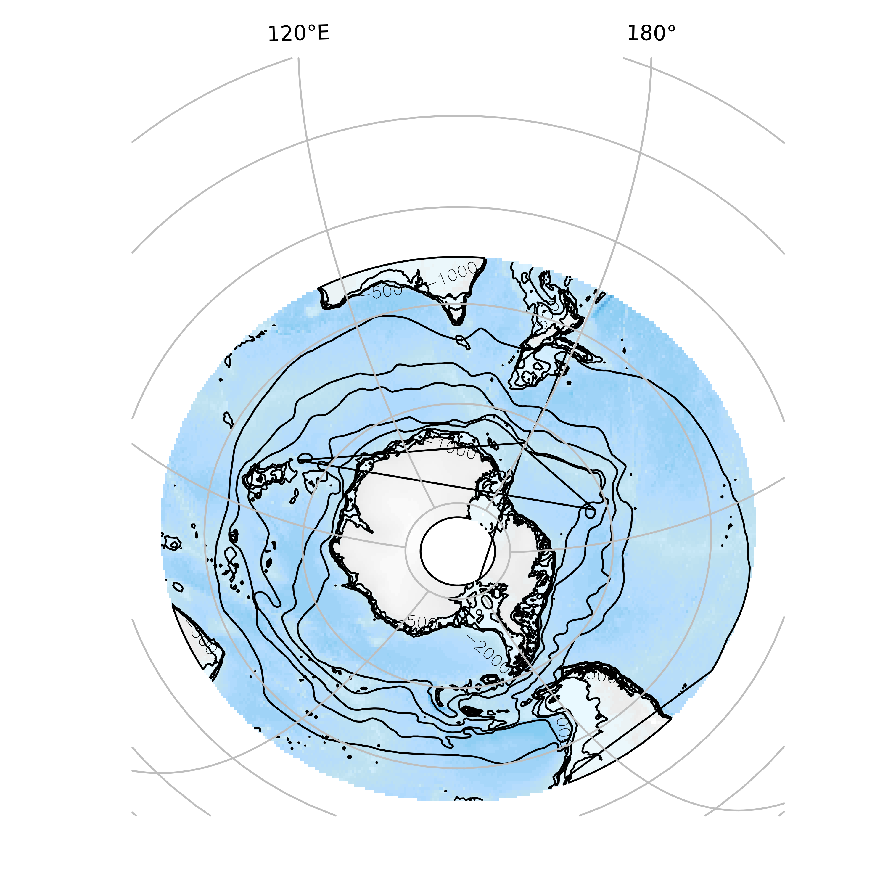

[](https://travis-ci.org/Maschette/SOmap)
[](https://ci.appveyor.com/project/Maschette/SOmap)
[](https://codecov.io/github/Maschette/SOmap?branch=master)
[](https://cran.r-project.org/package=SOmap)

<!-- README.md is generated from README.Rmd. Please edit that file -->

# SOmap 

The goal of SOmap is to make publication quality round Southern Ocean
maps in polar projections with little effort. This package is still very
much a work in progress contact me with any questions or suggestions.

## Installation

The development version from
[GitHub](https://github.com/Maschette/SOmap) with:

``` r
# install.packages("devtools")
devtools::install_github("Maschette/SOmap")
```

## Example

To make a simple map you can use the following function; use ?SOmap to
see all the options for modifying layers.

``` r
library(SOmap)
SOmap()
#> Loading required namespace: rgeos
```



There is also `SOmanagement()` which have management layers for the
Southern Ocean and `SOleg()` which gives custom rounded legends for
added map layers

``` r
## custom colours
 spiritedMedium <- grDevices::colorRampPalette(c("#4D4140", "#596F7E", "#168B98", "#ED5B67", "#E27766", "#DAAD50", "#EAC3A6"))
 spirited <- spiritedMedium(80)
 
SOmap::SOmap()
SOleg(position = "topright",
      col = spirited,
      ticks = 6,
      tlabs = c("0","20","40","60","80","100"),
      Trim = -45,
      label = "Sea Ice")
plot(ice, col = spirited, add=TRUE, legend = FALSE, alpha = 0.95) ## From raadtools
SOmanagement(EEZ = TRUE)
```



An **auto** plot function will take any data in the form of longitude
and latitude vectors and create a guess at a map. It returns the data
used to make the map so that further customization can be made.

``` r
tfile <- tempfile(fileext = "RData")
download.file("https://github.com/ianjonsen/bsam/raw/master/data/ellie.RData", tfile, mode = "wb")
load(tfile)
unlink(tfile)

track <- head(do.call(rbind, lapply(split(ellie, ellie$id), function(x) rbind(as.matrix(x[c("lon", "lat")], NA)))), -1)
SOauto_map(track[,1], track[,2])
```



``` r

graphics.off()
data("albatross", package = "adehabitatLT")
track <- rgdal::project(as.matrix(purrr::map_df(albatross, ~rbind(.x[c("x", "y")], NA))), "+proj=utm +zone=42 +south +datum=WGS84", inv = TRUE)
ellie_map <- SOauto_map(track[,1], track[,2])
```

Notice how we may use the plot interactively or also return the data for
further exploration.

``` r
names(ellie_map)
#> [1] "bathy"     "coastline" "target"    "data"      "graticule" "crs"
```

Objects from `sf` or `sp` may also be used. If a ‘raster’ is given it is
used only for its extent.

``` r
SOauto_map(SOmap_data$fronts_orsi, family = "laea", centre_lon = 147)
```



Please note that the ‘SOmap’ project is released with a [Contributor
Code of Conduct](CODE_OF_CONDUCT.md). By contributing to this project,
you agree to abide by its terms.
